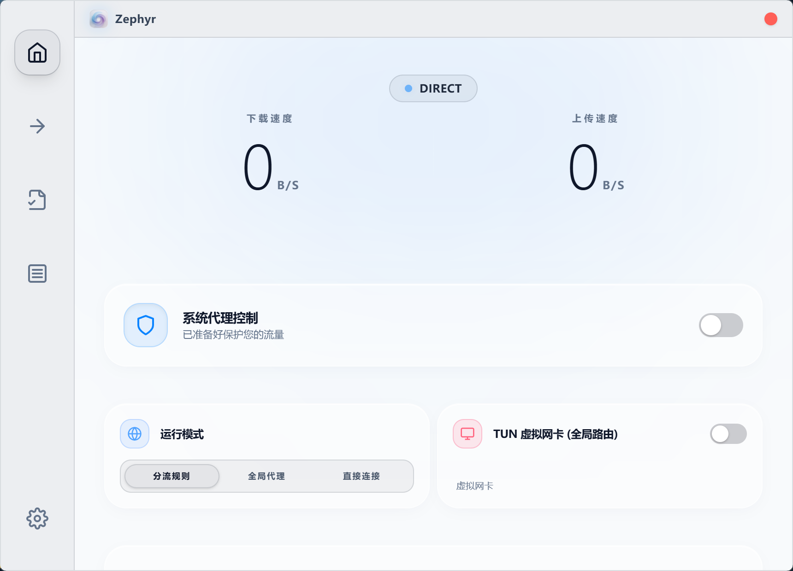
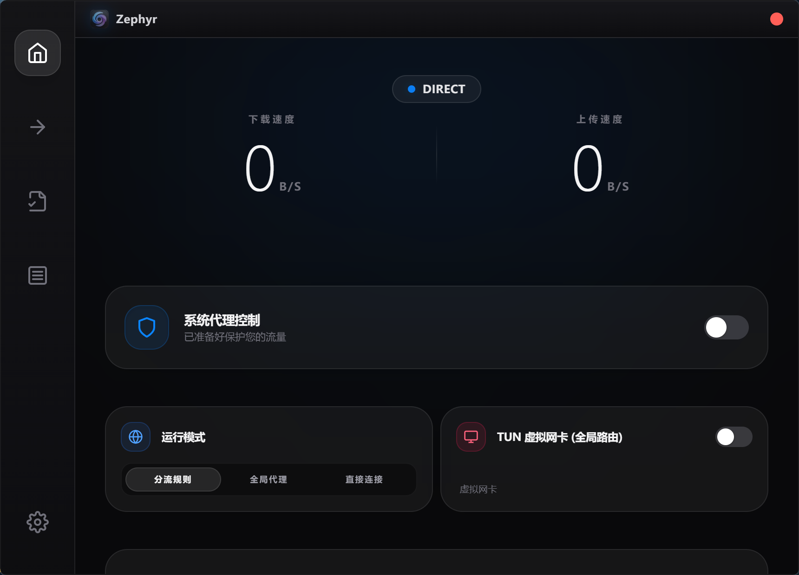

<div align="center">


# Zephyr

**A modern, lightweight, and secure Mihomo GUI client**

[](https://opensource.org/licenses/MIT)
[](https://github.com/Juwan-Hwang/Zephyr/releases)
[](https://tauri.app)
[](https://www.rust-lang.org/)

[English](#-english) | [简体中文](#-简体中文) | [日本語](#-日本語) | [한국어](#-한국어)

</div>

---

## 📸 Screenshots



<details>
<summary>📷 More Screenshots</summary>

| 设置 | 深色模式 |
|:---:|:---:|
|  |  |

</details>

---

<!--
========================================
 🇺🇸 ENGLISH VERSION
========================================
-->

## 🇺🇸 English

### Overview

Zephyr is a modern, high-performance GUI client for the Mihomo core, built with Tauri and native web technologies. It focuses on delivering a clean, efficient, and secure user experience for managing proxy networks with minimal resource footprint.

### Features

#### 🚀 Core Capabilities
- **Real-time Traffic Monitoring** — Live upstream/downstream speed visualization with animated charts
- **Smart Node Selection** — Multi-column adaptive layout for high-resolution displays with latency-based sorting
- **Fast Latency Testing** — Parallel latency checks with optimistic UI updates and background refresh
- **Multiple Running Modes** — Rule-based routing, Global proxy, and Direct connection modes
- **TUN Virtual Adapter** — System-wide transparent proxy with automatic route configuration

#### 🔒 Security First
- **SSRF Protection** — DNS resolution validation for subscription URLs, preventing internal network attacks
- **Supply Chain Security** — SHA256 integrity verification for all core and GeoIP updates
- **Secure Credential Storage** — Machine-bound encryption for subscription URLs and metadata
- **Path Traversal Prevention** — Comprehensive input validation for all file operations

#### 🖥️ Cross-Platform
- **Windows** — Full support with UWP loopback exemption utility
- **macOS** — Native support for both Intel and Apple Silicon (Universal Binary)
- **Linux** — Support for GNOME, KDE, and XFCE desktop environments

#### 📡 Subscription Management
- **Multi-format Support** — Compatible with Clash YAML, Base64-encoded subscriptions
- **Fake Client UA** — Spoof User-Agent to bypass provider sniffing
- **Batch Update** — Update all subscriptions with a single click
- **Drag & Drop Import** — Import YAML configs by dragging files into the window

#### ⚙️ Advanced Features
- **Custom Rules Editor** — Visual rule management with Shadowrocket rule import support
- **Port Forwarding** — TCP/UDP tunnel configuration with custom target addresses
- **DNS Rewrite** — Built-in anti-leak and Fake-IP DNS configuration
- **Auto-start** — Launch at login with system tray integration
- **Hot Reload** — Apply configuration changes without restarting the core

### Installation

Download the latest release from [GitHub Releases](https://github.com/Juwan-Hwang/Zephyr/releases):

#### Which version should I download?

| Version | File Pattern | Description |
|---------|--------------|-------------|
| **Full** | `*-setup-full.exe` / `*-full.dmg` / `*-full.AppImage` | Includes Mihomo core and GeoIP/GeoSite data. **Recommended for first-time users.** |
| **Lite** | `*-setup-lite.exe` / `*-lite.dmg` / `*-lite.AppImage` | Smaller size, no bundled core. For users who already have the core installed (e.g., updating). |

#### Download Links

| Platform | Full Version | Lite Version |
|----------|--------------|--------------|
| **Windows** | `Zephyr_x.x.x_x64-setup-full.exe` | `Zephyr_x.x.x_x64-setup-lite.exe` |
| **macOS (Intel)** | `Zephyr_x.x.x_x64-full.dmg` | `Zephyr_x.x.x_x64-lite.dmg` |
| **macOS (Apple Silicon)** | `Zephyr_x.x.x_aarch64-full.dmg` | `Zephyr_x.x.x_aarch64-lite.dmg` |
| **Linux** | `Zephyr_x.x.x_amd64-full.AppImage` | `Zephyr_x.x.x_amd64-lite.AppImage` |

### Build from Source

<details>
<summary>Click to expand build instructions</summary>

#### Prerequisites

- [Rust](https://www.rust-lang.org/tools/install) 1.70 or later
- [Node.js](https://nodejs.org/) 18 or later
- Platform-specific dependencies (see [Tauri Prerequisites](https://tauri.app/v2/guides/prerequisites/))

#### Build Steps

```bash
# Clone the repository
git clone https://github.com/Juwan-Hwang/Zephyr.git
cd Zephyr

# Install dependencies
npm install

# Run in development mode
npm run tauri dev

# Build for production
npm run tauri build
```

</details>

---

<!--
========================================
 🇨🇳 简体中文版本
========================================
-->

## 🇨🇳 简体中文

### 概述

Zephyr 是一款现代化的高性能 Mihomo 核心 GUI 客户端，基于 Tauri 和原生 Web 技术构建。专注于提供简洁、高效、安全的代理网络管理体验，同时保持极低的资源占用。

### 功能特性

#### 🚀 核心能力
- **实时流量监控** — 动态上下行速度可视化，配合精美的动画图表
- **智能节点选择** — 高分屏自适应多列布局，支持延迟优先排序
- **快速延迟测试** — 并行延迟检测，配合乐观 UI 更新与后台刷新
- **多种运行模式** — 规则分流、全局代理、直连模式自由切换
- **TUN 虚拟网卡** — 系统级透明代理，自动配置路由

#### 🔒 安全优先
- **SSRF 防护** — 订阅链接 DNS 解析验证，防止内网攻击
- **供应链安全** — 核心与 GeoIP 更新的 SHA256 完整性校验
- **安全凭证存储** — 订阅链接与元数据采用机器绑定加密
- **路径遍历防护** — 全面的文件操作输入验证

#### 🖥️ 跨平台支持
- **Windows** — 完整支持，内置 UWP 环回免除工具
- **macOS** — 原生支持 Intel 与 Apple Silicon（通用二进制）
- **Linux** — 支持 GNOME、KDE、XFCE 桌面环境

#### 📡 订阅管理
- **多格式兼容** — 支持 Clash YAML、Base64 编码订阅
- **客户端伪装** — 自定义 User-Agent 绕过机场嗅探
- **批量更新** — 一键更新所有订阅
- **拖拽导入** — 将 YAML 配置文件拖入窗口即可导入

#### ⚙️ 高级功能
- **自定义规则编辑器** — 可视化规则管理，支持导入 Shadowrocket 规则
- **端口转发** — TCP/UDP 隧道配置，支持自定义目标地址
- **DNS 覆写** — 内置防泄漏与 Fake-IP DNS 配置
- **开机自启** — 登录时自动启动，系统托盘集成
- **热重载** — 无需重启核心即可应用配置变更

### 安装方式

从 [GitHub Releases](https://github.com/Juwan-Hwang/Zephyr/releases) 下载最新版本：

#### 我应该下载哪个版本？

| 版本 | 文件特征 | 说明 |
|------|----------|------|
| **完整版** | `*-setup-full.exe` / `*-full.dmg` / `*-full.AppImage` | 包含 Mihomo 核心和 GeoIP/GeoSite 数据。**首次安装推荐下载。** |
| **精简版** | `*-setup-lite.exe` / `*-lite.dmg` / `*-lite.AppImage` | 体积更小，不含核心文件。适合已安装过核心的用户（如更新）。 |

#### 下载链接

| 平台 | 完整版 | 精简版 |
|------|--------|--------|
| **Windows** | `Zephyr_x.x.x_x64-setup-full.exe` | `Zephyr_x.x.x_x64-setup-lite.exe` |
| **macOS (Intel)** | `Zephyr_x.x.x_x64-full.dmg` | `Zephyr_x.x.x_x64-lite.dmg` |
| **macOS (Apple Silicon)** | `Zephyr_x.x.x_aarch64-full.dmg` | `Zephyr_x.x.x_aarch64-lite.dmg` |
| **Linux** | `Zephyr_x.x.x_amd64-full.AppImage` | `Zephyr_x.x.x_amd64-lite.AppImage` |

### 从源码构建

<details>
<summary>点击展开构建说明</summary>

#### 前置要求

- [Rust](https://www.rust-lang.org/tools/install) 1.70 或更高版本
- [Node.js](https://nodejs.org/) 18 或更高版本
- 平台特定依赖（参见 [Tauri 前置要求](https://tauri.app/v2/guides/prerequisites/)）

#### 构建步骤

```bash
# 克隆仓库
git clone https://github.com/Juwan-Hwang/Zephyr.git
cd Zephyr

# 安装依赖
npm install

# 开发模式运行
npm run tauri dev

# 生产构建
npm run tauri build
```

</details>

---

<!--
========================================
 🇯🇵 日本語バージョン
========================================
-->

## 🇯🇵 日本語

### 概要

Zephyr は Tauri とネイティブ Web 技術で構築された、モダンで高性能な Mihomo コア用 GUI クライアントです。シンプルで効率的、かつ安全なプロキシネットワーク管理体験を最小限のリソース消費で提供することに重点を置いています。

### 機能

#### 🚀 コア機能
- **リアルタイムトラフィック監視** — アニメーション付きチャートで上り/下り速度をリアルタイム表示
- **スマートノード選択** — 高解像度ディスプレイに対応したマルチカラムレイアウト、遅延順ソート対応
- **高速遅延テスト** — 楽観的 UI 更新とバックグラウンドリフレッシュによる並列遅延チェック
- **複数動作モード** — ルールベースルーティング、グローバルプロキシ、直接接続モード
- **TUN 仮想アダプター** — 自動ルート設定によるシステム全体の透過プロキシ

#### 🔒 セキュリティファースト
- **SSRF 保護** — サブスクリプション URL の DNS 解析検証、内部ネットワーク攻撃を防止
- **サプライチェーンセキュリティ** — コアおよび GeoIP 更新の SHA256 整合性検証
- **安全な認証情報ストレージ** — サブスクリプション URL とメタデータのマシン固有暗号化
- **パストラバーサル防止** — すべてのファイル操作に対する包括的な入力検証

#### 🖥️ クロスプラットフォーム
- **Windows** — UWP ループバック免除ユーティリティを含む完全サポート
- **macOS** — Intel および Apple Silicon のネイティブサポート（ユニバーサルバイナリ）
- **Linux** — GNOME、KDE、XFCE デスクトップ環境をサポート

#### 📡 サブスクリプション管理
- **マルチフォーマット対応** — Clash YAML、Base64 エンコードサブスクリプションに対応
- **フェイククライアント UA** — プロバイダーのスニッフィングを回避するための User-Agent 偽装
- **一括更新** — ワンクリックですべてのサブスクリプションを更新
- **ドラッグ＆ドロップインポート** — YAML 設定ファイルをウィンドウにドロップしてインポート

#### ⚙️ 高度な機能
- **カスタムルールエディター** — Shadowrocket ルールインポート対応のビジュアルルール管理
- **ポートフォワーディング** — カスタムターゲットアドレス指定の TCP/UDP トンネル設定
- **DNS リライト** — 内蔵のリーク防止と Fake-IP DNS 設定
- **自動起動** — ログイン時の自動起動、システムトレイ統合
- **ホットリロード** — コアを再起動せずに設定変更を適用

### インストール

[GitHub Releases](https://github.com/Juwan-Hwang/Zephyr/releases) から最新版をダウンロード：

#### どのバージョンをダウンロードすればいいですか？

| バージョン | ファイルパターン | 説明 |
|-----------|-----------------|------|
| **フル版** | `*-setup-full.exe` / `*-full.dmg` / `*-full.AppImage` | Mihomo コアと GeoIP/GeoSite データを含む。**初回ユーザーにおすすめ。** |
| **ライト版** | `*-setup-lite.exe` / `*-lite.dmg` / `*-lite.AppImage` | サイズが小さく、コア同梱なし。既にコアがインストールされているユーザー向け（更新など）。 |

#### ダウンロードリンク

| プラットフォーム | フル版 | ライト版 |
|----------------|--------|----------|
| **Windows** | `Zephyr_x.x.x_x64-setup-full.exe` | `Zephyr_x.x.x_x64-setup-lite.exe` |
| **macOS (Intel)** | `Zephyr_x.x.x_x64-full.dmg` | `Zephyr_x.x.x_x64-lite.dmg` |
| **macOS (Apple Silicon)** | `Zephyr_x.x.x_aarch64-full.dmg` | `Zephyr_x.x.x_aarch64-lite.dmg` |
| **Linux** | `Zephyr_x.x.x_amd64-full.AppImage` | `Zephyr_x.x.x_amd64-lite.AppImage` |

### ソースからビルド

<details>
<summary>クリックしてビルド手順を展開</summary>

#### 前提条件

- [Rust](https://www.rust-lang.org/tools/install) 1.70 以降
- [Node.js](https://nodejs.org/) 18 以降
- プラットフォーム固有の依存関係（[Tauri 前提条件](https://tauri.app/v2/guides/prerequisites/)を参照）

#### ビルド手順

```bash
# リポジトリをクローン
git clone https://github.com/Juwan-Hwang/Zephyr.git
cd Zephyr

# 依存関係をインストール
npm install

# 開発モードで実行
npm run tauri dev

# 本番用ビルド
npm run tauri build
```

</details>

---

<!--
========================================
 🇰🇷 한국어 버전
========================================
-->

## 🇰🇷 한국어

### 개요

Zephyr는 Tauri와 네이티브 웹 기술로 구축된 현대적이고 고성능인 Mihomo 코어용 GUI 클라이언트입니다. 최소한의 리소스 사용으로 깔끔하고 효율적이며 안전한 프록시 네트워크 관리 경험을 제공하는 데 중점을 둡니다.

### 기능

#### 🚀 핵심 기능
- **실시간 트래픽 모니터링** — 애니메이션 차트와 함께 업스트림/다운스트림 속도 실시간 시각화
- **스마트 노드 선택** — 고해상도 디스플레이를 위한 멀티컬럼 적응형 레이아웃, 지연 시간 기반 정렬
- **빠른 지연 테스트** — 낙관적 UI 업데이트와 백그라운드 새로고침을 통한 병렬 지연 확인
- **다중 실행 모드** — 규칙 기반 라우팅, 글로벌 프록시, 직접 연결 모드
- **TUN 가상 어댑터** — 자동 경로 구성을 통한 시스템 전체 투명 프록시

#### 🔒 보안 우선
- **SSRF 보호** — 구독 URL에 대한 DNS 확인 검증, 내부 네트워크 공격 방지
- **공급망 보안** — 코어 및 GeoIP 업데이트에 대한 SHA256 무결성 검증
- **안전한 자격 증명 저장** — 구독 URL 및 메타데이터에 대한 머신 바인딩 암호화
- **경로 순회 방지** — 모든 파일 작업에 대한 포괄적인 입력 검증

#### 🖥️ 크로스 플랫폼
- **Windows** — UWP 루프백 면제 유틸리티를 포함한 완전 지원
- **macOS** — Intel 및 Apple Silicon 네이티브 지원 (유니버설 바이너리)
- **Linux** — GNOME, KDE, XFCE 데스크톱 환경 지원

#### 📡 구독 관리
- **다중 포맷 지원** — Clash YAML, Base64 인코딩 구독 호환
- **가짜 클라이언트 UA** — 제공자 스니핑을 우회하기 위한 User-Agent 스푸핑
- **일괄 업데이트** — 원클릭으로 모든 구독 업데이트
- **드래그 앤 드롭 가져오기** — YAML 설정 파일을 창에 드롭하여 가져오기

#### ⚙️ 고급 기능
- **사용자 정의 규칙 편집기** — Shadowrocket 규칙 가져오기 지원, 시각적 규칙 관리
- **포트 포워딩** — 사용자 정의 대상 주소가 있는 TCP/UDP 터널 구성
- **DNS 재작성** — 내장 누출 방지 및 Fake-IP DNS 구성
- **자동 시작** — 로그인 시 자동 실행, 시스템 트레이 통합
- **핫 리로드** — 코어 재시작 없이 설정 변경 적용

### 설치

[GitHub Releases](https://github.com/Juwan-Hwang/Zephyr/releases)에서 최신 버전 다운로드:

#### 어떤 버전을 다운로드해야 하나요?

| 버전 | 파일 패턴 | 설명 |
|------|----------|------|
| **풀버전** | `*-setup-full.exe` / `*-full.dmg` / `*-full.AppImage` | Mihomo 코어와 GeoIP/GeoSite 데이터 포함. **처음 사용자에게 권장.** |
| **라이트버전** | `*-setup-lite.exe` / `*-lite.dmg` / `*-lite.AppImage` | 크기가 작고 코어 미포함. 이미 코어가 설치된 사용자용 (예: 업데이트). |

#### 다운로드 링크

| 플랫폼 | 풀버전 | 라이트버전 |
|--------|--------|-----------|
| **Windows** | `Zephyr_x.x.x_x64-setup-full.exe` | `Zephyr_x.x.x_x64-setup-lite.exe` |
| **macOS (Intel)** | `Zephyr_x.x.x_x64-full.dmg` | `Zephyr_x.x.x_x64-lite.dmg` |
| **macOS (Apple Silicon)** | `Zephyr_x.x.x_aarch64-full.dmg` | `Zephyr_x.x.x_aarch64-lite.dmg` |
| **Linux** | `Zephyr_x.x.x_amd64-full.AppImage` | `Zephyr_x.x.x_amd64-lite.AppImage` |

### 소스에서 빌드

<details>
<summary>클릭하여 빌드 지침 펼치기</summary>

#### 필수 조건

- [Rust](https://www.rust-lang.org/tools/install) 1.70 이상
- [Node.js](https://nodejs.org/) 18 이상
- 플랫폼별 종속성 ([Tauri 필수 조건](https://tauri.app/v2/guides/prerequisites/) 참조)

#### 빌드 단계

```bash
# 저장소 클론
git clone https://github.com/Juwan-Hwang/Zephyr.git
cd Zephyr

# 종속성 설치
npm install

# 개발 모드로 실행
npm run tauri dev

# 프로덕션 빌드
npm run tauri build
```

</details>

---

## 🤝 Contributing

Contributions are welcome! Please feel free to submit a Pull Request.

1. Fork the repository
2. Create your feature branch (`git checkout -b feature/AmazingFeature`)
3. Commit your changes (`git commit -m 'Add some AmazingFeature'`)
4. Push to the branch (`git push origin feature/AmazingFeature`)
5. Open a Pull Request

## 📄 License

This project is licensed under the **MIT License**.

```
MIT License

Copyright (c) 2026 Juwan Hwang (黄治文)

Permission is hereby granted, free of charge, to any person obtaining a copy
of this software and associated documentation files (the "Software"), to deal
in the Software without restriction, including without limitation the rights
to use, copy, modify, merge, publish, distribute, sublicense, and/or sell
copies of the Software, and to permit persons to whom the Software is
furnished to do so, subject to the following conditions:

The above copyright notice and this permission notice shall be included in all
copies or substantial portions of the Software.

THE SOFTWARE IS PROVIDED "AS IS", WITHOUT WARRANTY OF ANY KIND, EXPRESS OR
IMPLIED, INCLUDING BUT NOT LIMITED TO THE WARRANTIES OF MERCHANTABILITY,
FITNESS FOR A PARTICULAR PURPOSE AND NONINFRINGEMENT. IN NO EVENT SHALL THE
AUTHORS OR COPYRIGHT HOLDERS BE LIABLE FOR ANY CLAIM, DAMAGES OR OTHER
LIABILITY, WHETHER IN AN ACTION OF CONTRACT, TORT OR OTHERWISE, ARISING FROM,
OUT OF OR IN CONNECTION WITH THE SOFTWARE OR THE USE OR OTHER DEALINGS IN THE
SOFTWARE.
```

## 🙏 Acknowledgments

- [Mihomo](https://github.com/MetaCubeX/mihomo) — The powerful proxy core engine
- [Tauri](https://tauri.app) — Build smaller, faster, and more secure desktop apps
- [Tailwind CSS](https://tailwindcss.com) — A utility-first CSS framework

---

<div align="center">

**Made with ❤️ by Zephyr Team**

[⬆ Back to Top](#zephyr)

</div>
