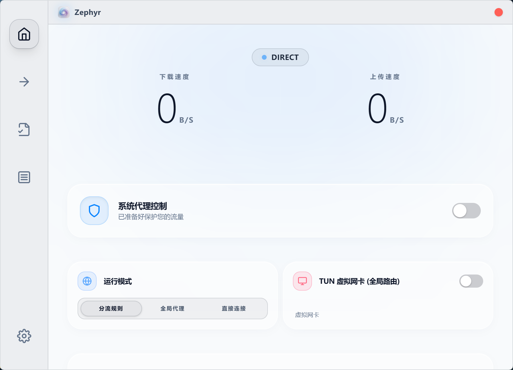
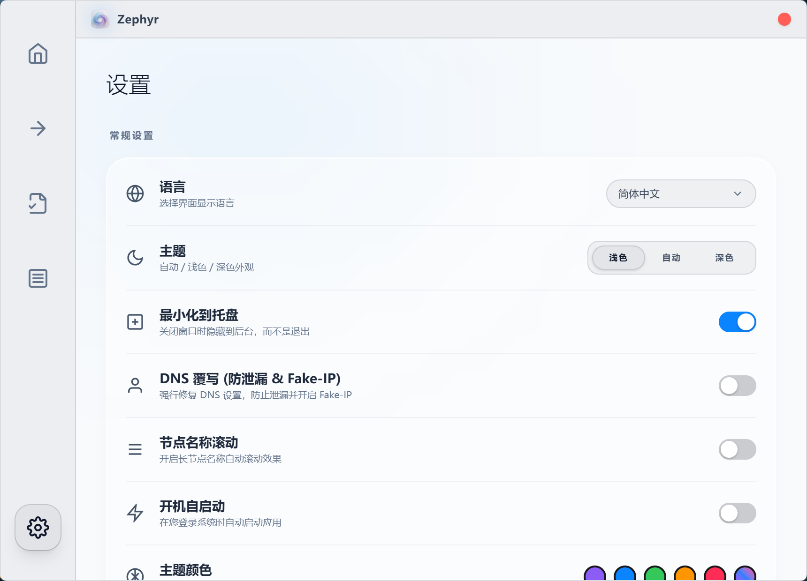
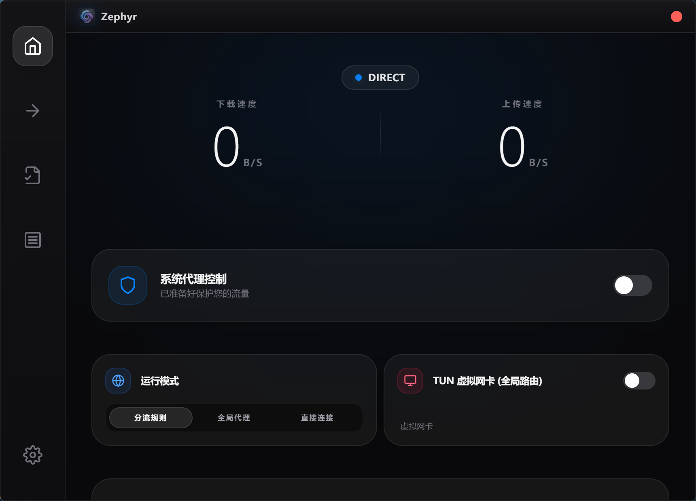

<div align="center">


# Zephyr

**安全至上 · 极简美学 · 轻量高效**

> 一款为颜值而生、以安全为核的 Mihomo GUI 客户端

[](https://opensource.org/licenses/MIT)
[](https://github.com/Juwan-Hwang/Zephyr/releases)
[](https://tauri.app)
[](https://www.rust-lang.org/)
[]()

[简体中文](#-简体中文) | [English](#-english) | [日本語](#-日本語) | [한국어](#-한국어)

</div>

---

> 💡 **关于这个项目**
>
> 本项目的开发起因很简单：目前我还没有找到符合自己审美的 Mihomo GUI，所以就自己 "vibe coding" 了一个。
>
> 由于项目中的所有内容（包括这段说明）都是由 AI 生成的，因此其安全性和性能目前均未经充分验证，请自行评估使用风险。
>
> 本项目主要用于个人自用，因此绝大多数 PR 可能不会合并；如果你有自己的需求，欢迎自行 Fork 并修改。
>
> 如果你发现了安全问题或 Bug，欢迎提交 Issue 反馈。
>
> ---
>
> The reason for developing this project is simple: I haven't found a Mihomo GUI that matches my aesthetic preferences, so I "vibe coded" one myself.
>
> Since all content in this project (including this disclaimer) is AI-generated, its security and performance have not been fully verified. Please evaluate the risks before using.
>
> This project is primarily for personal use, so most PRs may not be merged. If you have your own requirements, feel free to Fork and modify it yourself.
>
> If you discover security issues or bugs, you are welcome to submit an Issue.

---

## 📸 应用截图



<details>
<summary>📷 更多截图</summary>

| 设置页面 | 深色模式 |
|:---:|:---:|
|  |  |

</details>

---

<!--
========================================
 🇨🇳 简体中文版本
========================================
-->

## 🇨🇳 简体中文

### 为什么选择 Zephyr？

在众多 Mihomo GUI 客户端中，Zephyr 的差异化在于两个核心追求：**极致的安全设计** 与 **不妥协的视觉体验**。

#### 🎨 为颜值而生

- **毛玻璃卡片设计** — 半透明背景配合 backdrop-blur，营造现代感十足的视觉层次
- **渐变色图标系统** — 每个功能模块拥有独特的渐变色彩标识，直觉化信息传达
- **精致深色模式** — 不仅是简单的颜色反转，而是完整的深色主题设计，对比度与舒适度兼顾
- **优雅的动效细节** — 流量图表的平滑曲线、开关的过渡动画、延迟排序的乐观更新
- **克制的留白与排版** — 充足的呼吸空间，清晰的信息层级，让界面既信息丰富又不显杂乱

#### 🔒 为安全而生

Zephyr 在安全方面的投入在开源代理客户端中是**独一无二**的。我们构建了多层纵深防御体系：

| 安全层级 | 机制 | 说明 |
|:---:|:---|:---|
| **数据保护** | AES-256-GCM 加密 | 订阅链接与元数据采用机器绑定加密，密钥从硬件指纹通过 PBKDF2（10万次迭代）派生 |
| **网络安全** | SSRF 防护 | DNS 解析验证 + 私有 IP 拦截 + DNS 重绑定防护（IP Pinning）+ 最大重定向限制 |
| **配置安全** | 危险键清洗 | 递归移除 YAML 中的 `script`、`script-path`、`provider path` 等可执行注入向量 |
| **供应链** | SHA256 校验 | 所有核心与 GeoIP 数据下载均经哈希验证，仅允许来自可信源的下载 |
| **文件系统** | 路径遍历防护 | 完整的文件名清洗（URL 解码、空字节、保留名检查）+ 安全文件写入（Unix 0600 / Windows DACL） |
| **运行时** | 命令速率限制 | 防止核心管理接口被滥用 |
| **DevSecOps** | 三重安全扫描 | CI/CD 集成 CodeQL + Semgrep + cargo-deny，配合 Dependabot 自动依赖更新 |


### 功能特性

#### 🚀 核心能力

- **实时流量监控** — Canvas 绘制的平滑面积图，60 秒历史数据，二次曲线插值
- **智能节点选择** — 高分屏自适应多列布局，支持延迟优先排序与乐观 UI 更新
- **快速延迟测试** — 并行延迟检测，支持取消，使用 gstatic 204 测试点
- **多种运行模式** — 规则分流、全局代理、直连模式一键切换
- **TUN 虚拟网卡** — 系统级透明代理，macOS 自动提权配置

#### 🛡️ 安全特性

- **机器绑定加密** — 凭证绑定到当前设备，即使配置文件泄露也无法在其他机器上使用
- **SSRF 完整防护** — 订阅 URL 下载前进行 DNS 解析验证，拦截指向内网/回环地址的请求
- **DNS 重绑定防护** — 通过 IP Pinning 防止 DNS 重绑定攻击
- **配置注入防御** — 自动清洗配置文件中的可执行脚本字段
- **供应链完整性** — 核心二进制和 GeoIP 数据更新均通过 SHA256 校验
- **安全文件操作** — 路径遍历防护 + 安全权限设置（仅当前用户可读写）
- **UWP 环回免除** — Windows 平台内置工具，需用户确认后执行

#### 🖥️ 跨平台支持

| 平台 | 支持情况 | 备注 |
|:---:|:---|:---|
| **Windows** | x64 | 内置 UWP 环回免除工具 |
| **macOS** | x64 + Apple Silicon | 通用二进制，TUN 模式自动提权 |
| **Linux** | x64 | 支持 GNOME / KDE / XFCE 桌面环境的系统代理设置 |

#### 📡 订阅管理

- **多格式兼容** — Clash YAML、Base64 编码订阅
- **客户端伪装** — 自定义 User-Agent（Shadowrocket 模式），绕过机场嗅探
- **多通道下载** — 直连 → Mihomo 代理 → 系统代理，自动回退
- **批量更新** — 一键更新所有订阅
- **拖拽导入** — 将 YAML 配置文件拖入窗口即可导入

#### ⚙️ 高级功能

- **自定义规则编辑器** — 可视化规则管理，支持导入 Shadowrocket 规则（12 种规则类型）
- **端口转发** — TCP/UDP 隧道配置，支持自定义目标地址
- **DNS 覆写** — 内置防泄漏与 Fake-IP DNS 配置
- **配置热重载** — 无需重启核心即可应用配置变更，支持深度合并
- **系统代理管理** — Windows（注册表）/ macOS（networksetup）/ Linux（gsettings）全平台原生实现
- **系统托盘** — 最小化到托盘，动态菜单显示代理状态与节点切换
- **开机自启** — 登录时自动启动

### 技术栈

| 层级 | 技术 | 说明 |
|:---:|:---:|:---|
| **桌面框架** | Tauri v2 | 相比 Electron 内存占用降低 60%-80% |
| **后端** | Rust | 内存安全、零成本抽象、高性能 |
| **前端** | 原生 JS + Tailwind CSS v4 | 零框架依赖，极致轻量 |
| **代理核心** | Mihomo | 强大的 Clash Meta 内核 |

### 安装方式

从 [GitHub Releases](https://github.com/Juwan-Hwang/Zephyr/releases) 下载最新版本。

#### 我应该下载哪个版本？

| 版本 | 文件特征 | 说明 |
|------|----------|------|
| **完整版** | `*-setup-full.exe` / `*-full.dmg` / `*-full.AppImage` | 包含 Mihomo 核心和 GeoIP/GeoSite 数据。**首次安装推荐。** |
| **精简版** | `*-setup-lite.exe` / `*-lite.dmg` / `*-lite.AppImage` | 体积更小，不含核心文件。适合已安装过核心的用户。 |

#### 下载链接

| 平台 | 完整版 | 精简版 |
|------|--------|--------|
| **Windows** | `Zephyr_x.x.x_x64-setup-full.exe` | `Zephyr_x.x.x_x64-setup-lite.exe` |
| **macOS (Intel)** | `Zephyr_x.x.x_x64-full.dmg` | `Zephyr_x.x.x_x64-lite.dmg` |
| **macOS (Apple Silicon)** | `Zephyr_x.x.x_aarch64-full.dmg` | `Zephyr_x.x.x_aarch64-lite.dmg` |
| **Linux** | `Zephyr_x.x.x_amd64-full.AppImage` | `Zephyr_x.x.x_amd64-lite.AppImage` |

### 从源码构建

<details>
<summary>点击展开构建说明</summary>

#### 前置要求

- [Rust](https://www.rust-lang.org/tools/install) 1.70 或更高版本
- [Node.js](https://nodejs.org/) 18 或更高版本
- 平台特定依赖（参见 [Tauri 前置要求](https://tauri.app/v2/guides/prerequisites/)）

#### 构建步骤

```bash
# 克隆仓库
git clone https://github.com/Juwan-Hwang/Zephyr.git
cd Zephyr

# 安装依赖
npm install

# 开发模式运行
npm run tauri dev

# 生产构建
npm run tauri build
```

</details>

---

<!--
========================================
 🇺🇸 ENGLISH VERSION
========================================
-->

## 🇺🇸 English

### Why Zephyr?

Among the many Mihomo GUI clients, Zephyr stands out with two core pursuits: **security by design** and **aesthetics without compromise**.

#### 🎨 Built for Beauty

- **Glassmorphism Cards** — Translucent backgrounds with backdrop-blur for a modern, layered visual experience
- **Gradient Icon System** — Each feature module has its own unique gradient color identity for intuitive recognition
- **Refined Dark Mode** — A complete dark theme design with carefully balanced contrast and comfort
- **Elegant Animations** — Smooth traffic chart curves, toggle transitions, and optimistic latency sorting
- **Thoughtful Whitespace** — Generous breathing room with clear information hierarchy

#### 🔒 Built for Security

Zephyr's security investment is **unique** among open-source proxy clients. We've built a defense-in-depth system:

| Security Layer | Mechanism | Description |
|:---:|:---|:---|
| **Data Protection** | AES-256-GCM Encryption | Subscription URLs and metadata are encrypted with machine-bound keys derived from hardware fingerprints via PBKDF2 (100K iterations) |
| **Network Security** | SSRF Protection | DNS resolution validation + private IP blocking + DNS rebinding protection (IP Pinning) + max redirect limit |
| **Config Security** | Dangerous Key Sanitization | Recursive removal of `script`, `script-path`, `provider path` and other executable injection vectors from YAML |
| **Supply Chain** | SHA256 Verification | All core and GeoIP downloads are hash-verified, only allowing downloads from trusted sources |
| **File System** | Path Traversal Prevention | Complete filename sanitization (URL decoding, null bytes, reserved names) + secure file writing (Unix 0600 / Windows DACL) |
| **Runtime** | Rate Limiting | Prevents abuse of core management interfaces |
| **DevSecOps** | Triple Security Scanning | CI/CD integrates CodeQL + Semgrep + cargo-deny, with Dependabot for automated dependency updates |


### Features

#### 🚀 Core Capabilities

- **Real-time Traffic Monitoring** — Canvas-rendered smooth area chart with 60-second history and quadratic curve interpolation
- **Smart Node Selection** — Multi-column adaptive layout for high-DPI displays with latency-based sorting and optimistic UI updates
- **Fast Latency Testing** — Parallel latency checks with cancellation support via gstatic 204 test endpoint
- **Multiple Running Modes** — Rule-based routing, Global proxy, and Direct connection with one-click switching
- **TUN Virtual Adapter** — System-wide transparent proxy with automatic privilege escalation on macOS

#### 🛡️ Security Features

- **Machine-bound Encryption** — Credentials are bound to the current device; leaked config files are useless on other machines
- **Complete SSRF Protection** — DNS resolution validation before subscription downloads, blocking requests to internal/loopback addresses
- **DNS Rebinding Protection** — IP Pinning prevents DNS rebinding attacks
- **Config Injection Defense** — Automatic sanitization of executable script fields in configuration files
- **Supply Chain Integrity** — SHA256 verification for core binary and GeoIP data updates
- **Secure File Operations** — Path traversal prevention + secure permission settings (owner-read/write only)
- **UWP Loopback Exemption** — Built-in Windows tool with user confirmation required

#### 🖥️ Cross-Platform Support

| Platform | Support | Notes |
|:---:|:---|:---|
| **Windows** | x64 | Built-in UWP loopback exemption tool |
| **macOS** | x64 + Apple Silicon | Universal binary, auto-privilege escalation for TUN mode |
| **Linux** | x64 | System proxy support for GNOME / KDE / XFCE desktop environments |

#### 📡 Subscription Management

- **Multi-format Support** — Clash YAML, Base64-encoded subscriptions
- **Client Spoofing** — Custom User-Agent (Shadowrocket mode) to bypass provider sniffing
- **Multi-channel Download** — Direct → Mihomo proxy → System proxy with automatic fallback
- **Batch Update** — Update all subscriptions with a single click
- **Drag & Drop Import** — Import YAML configs by dragging files into the window

#### ⚙️ Advanced Features

- **Custom Rules Editor** — Visual rule management with Shadowrocket rule import (12 rule types)
- **Port Forwarding** — TCP/UDP tunnel configuration with custom target addresses
- **DNS Rewrite** — Built-in anti-leak and Fake-IP DNS configuration
- **Hot Reload** — Apply configuration changes without restarting the core, with deep merge support
- **System Proxy Management** — Native implementation for Windows (Registry) / macOS (networksetup) / Linux (gsettings)
- **System Tray** — Minimize to tray with dynamic menu showing proxy status and node switching
- **Auto-start** — Launch at login with system tray integration

### Tech Stack

| Layer | Technology | Description |
|:---:|:---:|:---|
| **Desktop Framework** | Tauri v2 | 60%-80% less memory usage than Electron |
| **Backend** | Rust | Memory safety, zero-cost abstractions, high performance |
| **Frontend** | Vanilla JS + Tailwind CSS v4 | Zero framework dependencies, ultra-lightweight |
| **Proxy Core** | Mihomo | Powerful Clash Meta core engine |

### Installation

Download the latest release from [GitHub Releases](https://github.com/Juwan-Hwang/Zephyr/releases).

#### Which version should I download?

| Version | File Pattern | Description |
|---------|--------------|-------------|
| **Full** | `*-setup-full.exe` / `*-full.dmg` / `*-full.AppImage` | Includes Mihomo core and GeoIP/GeoSite data. **Recommended for first-time users.** |
| **Lite** | `*-setup-lite.exe` / `*-lite.dmg` / `*-lite.AppImage` | Smaller size, no bundled core. For users who already have the core installed. |

#### Download Links

| Platform | Full Version | Lite Version |
|----------|--------------|--------------|
| **Windows** | `Zephyr_x.x.x_x64-setup-full.exe` | `Zephyr_x.x.x_x64-setup-lite.exe` |
| **macOS (Intel)** | `Zephyr_x.x.x_x64-full.dmg` | `Zephyr_x.x.x_x64-lite.dmg` |
| **macOS (Apple Silicon)** | `Zephyr_x.x.x_aarch64-full.dmg` | `Zephyr_x.x.x_aarch64-lite.dmg` |
| **Linux** | `Zephyr_x.x.x_amd64-full.AppImage` | `Zephyr_x.x.x_amd64-lite.AppImage` |

### Build from Source

<details>
<summary>Click to expand build instructions</summary>

#### Prerequisites

- [Rust](https://www.rust-lang.org/tools/install) 1.70 or later
- [Node.js](https://nodejs.org/) 18 or later
- Platform-specific dependencies (see [Tauri Prerequisites](https://tauri.app/v2/guides/prerequisites/))

#### Build Steps

```bash
# Clone the repository
git clone https://github.com/Juwan-Hwang/Zephyr.git
cd Zephyr

# Install dependencies
npm install

# Run in development mode
npm run tauri dev

# Build for production
npm run tauri build
```

</details>

---

<!--
========================================
 🇯🇵 日本語バージョン
========================================
-->

## 🇯🇵 日本語

### なぜ Zephyr なのか？

多くの Mihomo GUI クライアントの中で、Zephyr は2つのコアな追求において際立っています：**セキュリティ・バイ・デザイン** と **美しさへの妥協なきこだわり**。

#### 🎨 美しさのために

- **グラスモーフィズムカード** — 半透明の背景とbackdrop-blurによるモダンな視覚的階層
- **グラデーションアイコンシステム** — 各機能モジュールが独自のグラデーションカラーで直感的に認識可能
- **洗練されたダークモード** — コントラストと快適性を両立した完全なダークテーマデザイン
- **エレガントなアニメーション** — スムーズなトラフィックチャート、トグルのトランジション、楽観的レイテンシソート
- **思いやりのある余白** — 十分な呼吸スペースと明確な情報階層

#### 🔒 セキュリティのために

Zephyr のセキュリティへの投資は、オープンソースプロキシクライアントの中で**唯一無二**です。多層防御システムを構築しています：

| セキュリティ層 | メカニズム | 説明 |
|:---:|:---|:---|
| **データ保護** | AES-256-GCM暗号化 | サブスクリプションURLとメタデータをハードウェアフィンガープリントからPBKDF2（10万回反復）で派生したマシン固有鍵で暗号化 |
| **ネットワーク** | SSRF保護 | DNS解決検証 + プライベートIPブロック + DNSリバインディング保護（IPピニング）+ 最大リダイレクト制限 |
| **設定セキュリティ** | 危険なキーの除去 | YAMLから`script`、`script-path`、`provider path`などの実行可能なインジェクションベクトルを再帰的に削除 |
| **サプライチェーン** | SHA256検証 | すべてのコアとGeoIPダウンロードはハッシュ検証済み、信頼できるソースからのダウンロードのみ許可 |
| **ファイルシステム** | パストラバーサル防止 | 完全なファイル名サニタイズ（URLデコード、nullバイト、予約名チェック）+ セキュアなファイル書き込み（Unix 0600 / Windows DACL） |
| **ランタイム** | レート制限 | コア管理インターフェースの悪用を防止 |
| **DevSecOps** | 三重セキュリティスキャン | CI/CDでCodeQL + Semgrep + cargo-denyを統合、Dependabotで自動依存関係更新 |

### 機能

#### 🚀 コア機能
- **リアルタイムトラフィック監視** — Canvas描画のスムーズなエリアチャート、60秒履歴、二次曲線補間
- **スマートノード選択** — 高解像度ディスプレイ対応マルチカラムレイアウト、遅延ソートと楽観的UI更新
- **高速遅延テスト** — 並列遅延チェック、キャンセル対応、gstatic 204テストエンドポイント
- **複数動作モード** — ルールベースルーティング、グローバルプロキシ、直接接続をワンクリック切替
- **TUN仮想アダプター** — macOSで自動権限昇格するシステム全体の透過プロキシ

#### 🛡️ セキュリティ機能
- **マシンバインド暗号化** — 証明情報は現在のデバイスにバインド、設定ファイルの漏洩でも他マシンでは使用不可
- **完全なSSRF保護** — サブスクリプションダウンロード前のDNS解決検証、内部/ループバックアドレスへのリクエストをブロック
- **DNSリバインディング保護** — IPピニングによるDNSリバインディング攻撃の防止
- **設定インジェクション防御** — 設定ファイル内の実行可能スクリプトフィールドの自動サニタイズ
- **サプライチェーン完全性** — コアバイナリとGeoIPデータ更新のSHA256検証
- **セキュアなファイル操作** — パストラバーサル防止 + セキュアな権限設定（所有者読み書きのみ）
- **UWPループバック免除** — ユーザー確認が必要なWindows組み込みツール

#### 🖥️ クロスプラットフォーム
- **Windows** — UWPループバック免除ユーティリティ内蔵
- **macOS** — Intel / Apple Siliconネイティブサポート（ユニバーサルバイナリ）、TUNモード自動権限昇格
- **Linux** — GNOME / KDE / XFCEデスクトップ環境のシステムプロキシ設定に対応

#### 📡 サブスクリプション管理
- **マルチフォーマット対応** — Clash YAML、Base64エンコードサブスクリプション
- **クライアント偽装** — カスタムUser-Agent（Shadowrocketモード）でプロバイダーのスニッフィングを回避
- **マルチチャネルダウンロード** — 直接 → Mihomoプロキシ → システムプロキシの自動フォールバック
- **一括更新** — ワンクリックですべてのサブスクリプションを更新
- **ドラッグ＆ドロップインポート** — YAML設定ファイルをウィンドウにドロップしてインポート

#### ⚙️ 高度な機能
- **カスタムルールエディター** — Shadowrocketルールインポート対応（12ルールタイプ）のビジュアルルール管理
- **ポートフォワーディング** — カスタムターゲットアドレス指定のTCP/UDPトンネル設定
- **DNSリライト** — 内蔵のリーク防止とFake-IP DNS設定
- **ホットリロード** — コア再起動なしの設定変更適用、ディープマージ対応
- **システムプロキシ管理** — Windows（レジストリ）/ macOS（networksetup）/ Linux（gsettings）のネイティブ実装
- **システムトレイ** — 最小化からトレイ、プロキシステータスとノード切替のダイナミックメニュー
- **自動起動** — ログイン時の自動起動、システムトレイ統合

### インストール

[GitHub Releases](https://github.com/Juwan-Hwang/Zephyr/releases) から最新版をダウンロード：

| バージョン | ファイルパターン | 説明 |
|-----------|-----------------|------|
| **フル版** | `*-setup-full.exe` / `*-full.dmg` / `*-full.AppImage` | MihomoコアとGeoIP/GeoSiteデータを含む。**初回ユーザーにおすすめ。** |
| **ライト版** | `*-setup-lite.exe` / `*-lite.dmg` / `*-lite.AppImage` | サイズが小さく、コア同梱なし。既にコアがインストールされているユーザー向け。 |

### ソースからビルド

<details>
<summary>クリックしてビルド手順を展開</summary>

#### 前提条件

- [Rust](https://www.rust-lang.org/tools/install) 1.70 以降
- [Node.js](https://nodejs.org/) 18 以降
- プラットフォーム固有の依存関係（[Tauri 前提条件](https://tauri.app/v2/guides/prerequisites/)を参照）

#### ビルド手順

```bash
# リポジトリをクローン
git clone https://github.com/Juwan-Hwang/Zephyr.git
cd Zephyr

# 依存関係をインストール
npm install

# 開発モードで実行
npm run tauri dev

# 本番用ビルド
npm run tauri build
```

</details>

---

<!--
========================================
 🇰🇷 한국어 버전
========================================
-->

## 🇰🇷 한국어

### 왜 Zephyr인가?

수많은 Mihomo GUI 클라이언트 중에서 Zephyr는 두 가지 핵심 추구에서 돋보입니다: **보안 by 디자인**과 **타협 없는 미적 감각**.

#### 🎨 아름다움을 위해

- **글래스모피즘 카드** — 반투명 배경과 backdrop-blur로 모던한 시각적 계층 구현
- **그라디언트 아이콘 시스템** — 각 기능 모듈이 고유한 그라디언트 색상으로 직관적 인식 가능
- **세련된 다크 모드** — 대비와 편안함을 모두 고려한 완전한 다크 테마 디자인
- **우아한 애니메이션** — 부드러운 트래픽 차트, 토글 전환, 낙관적 지연 시간 정렬
- **여백의 미** — 충분한 여유 공간과 명확한 정보 계층

#### 🔒 보안을 위해

Zephyr의 보안 투자는 오픈소스 프록시 클라이언트 중 **유일무이**합니다. 다계층 방어 시스템을 구축했습니다:

| 보안 계층 | 메커니즘 | 설명 |
|:---:|:---|:---|
| **데이터 보호** | AES-256-GCM 암호화 | 하드웨어 지문에서 PBKDF2(10만 반복)로 파생된 머신 바인딩 키로 구독 URL 및 메타데이터 암호화 |
| **네트워크** | SSRF 보호 | DNS 확인 검증 + 프라이빗 IP 차단 + DNS 리바인딩 보호(IP 핀닝) + 최대 리다이렉트 제한 |
| **설정 보안** | 위험한 키 제거 | YAML에서 `script`, `script-path`, `provider path` 등 실행 가능한 인젝션 벡터를 재귀적으로 제거 |
| **공급망** | SHA256 검증 | 모든 코어 및 GeoIP 다운로드 해시 검증, 신뢰할 수 있는 소스에서만 다운로드 허용 |
| **파일 시스템** | 경로 순회 방지 | 완전한 파일명 정화(URL 디코딩, null 바이트, 예약어 확인) + 안전한 파일 쓰기(Unix 0600 / Windows DACL) |
| **런타임** | 속도 제한 | 코어 관리 인터페이스 남용 방지 |
| **DevSecOps** | 삼중 보안 스캔 | CI/CD에 CodeQL + Semgrep + cargo-deny 통합, Dependabot으로 자동 의존성 업데이트 |

### 기능

#### 🚀 핵심 기능
- **실시간 트래픽 모니터링** — Canvas 렌더링 부드러운 영역 차트, 60초 기록, 이차 곡선 보간
- **스마트 노드 선택** — 고해상도 디스플레이용 멀티컬럼 적응형 레이아웃, 지연 시간 기반 정렬 및 낙관적 UI 업데이트
- **빠른 지연 테스트** — 병렬 지연 확인, 취소 지원, gstatic 204 테스트 엔드포인트
- **다중 실행 모드** — 규칙 기반 라우팅, 글로벌 프록시, 직접 연결 원클릭 전환
- **TUN 가상 어댑터** — macOS에서 자동 권한 상승하는 시스템 전체 투명 프록시

#### 🛡️ 보안 기능
- **머신 바인딩 암호화** — 자격 증명을 현재 장치에 바인딩, 설정 파일 유출 시 다른 머신에서 사용 불가
- **완전한 SSRF 보호** — 구독 다운로드 전 DNS 확인 검증, 내부/루프백 주소로의 요청 차단
- **DNS 리바인딩 보호** — IP 핀닝으로 DNS 리바인딩 공격 방지
- **설정 인젝션 방어** — 설정 파일의 실행 가능한 스크립트 필드 자동 정화
- **공급망 무결성** — 코어 바이너리 및 GeoIP 데이터 업데이트 SHA256 검증
- **안전한 파일 작업** — 경로 순회 방지 + 안전한 권한 설정(소유자 읽기/쓰기만)
- **UWP 루프백 면제** — 사용자 확인이 필요한 Windows 내장 도구

#### 🖥️ 크로스 플랫폼
- **Windows** — UWP 루프백 면제 유틸리티 내장
- **macOS** — Intel / Apple Silicon 네이티브 지원(유니버설 바이너리), TUN 모드 자동 권한 상승
- **Linux** — GNOME / KDE / XFCE 데스크톱 환경의 시스템 프록시 설정 지원

#### 📡 구독 관리
- **다중 포맷 지원** — Clash YAML, Base64 인코딩 구독
- **클라이언트 위장** — 커스텀 User-Agent(Shadowrocket 모드)로 제공자 스니핑 우회
- **멀티채널 다운로드** — 직접 → Mihomo 프록시 → 시스템 프록시 자동 폴백
- **일괄 업데이트** — 원클릭으로 모든 구독 업데이트
- **드래그 앤 드롭 가져오기** — YAML 설정 파일을 창에 드롭하여 가져오기

#### ⚙️ 고급 기능
- **사용자 정의 규칙 편집기** — Shadowrocket 규칙 가져오기 지원(12 규칙 유형)의 시각적 규칙 관리
- **포트 포워딩** — 커스텀 타겟 주소가 있는 TCP/UDP 터널 구성
- **DNS 재작성** — 내장 누출 방지 및 Fake-IP DNS 설정
- **핫 리로드** — 코어 재시작 없이 설정 변경 적용, 딥 머지 지원
- **시스템 프록시 관리** — Windows(레지스트리) / macOS(networksetup) / Linux(gsettings) 네이티브 구현
- **시스템 트레이** — 최소화에서 트레이, 프록시 상태 및 노드 전환의 동적 메뉴
- **자동 시작** — 로그인 시 자동 실행, 시스템 트레이 통합

### 설치

[GitHub Releases](https://github.com/Juwan-Hwang/Zephyr/releases)에서 최신 버전 다운로드:

| 버전 | 파일 패턴 | 설명 |
|------|----------|------|
| **풀버전** | `*-setup-full.exe` / `*-full.dmg` / `*-full.AppImage` | Mihomo 코어와 GeoIP/GeoSite 데이터 포함. **처음 사용자에게 권장.** |
| **라이트버전** | `*-setup-lite.exe` / `*-lite.dmg` / `*-lite.AppImage` | 크기가 작고 코어 미포함. 이미 코어가 설치된 사용자용. |

### 소스에서 빌드

<details>
<summary>클릭하여 빌드 지침 펼치기</summary>

#### 필수 조건

- [Rust](https://www.rust-lang.org/tools/install) 1.70 이상
- [Node.js](https://nodejs.org/) 18 이상
- 플랫폼별 종속성 ([Tauri 필수 조건](https://tauri.app/v2/guides/prerequisites/) 참조)

#### 빌드 단계

```bash
# 저장소 클론
git clone https://github.com/Juwan-Hwang/Zephyr.git
cd Zephyr

# 종속성 설치
npm install

# 개발 모드로 실행
npm run tauri dev

# 프로덕션 빌드
npm run tauri build
```

</details>

---

## 🤝 Contributing

This project is primarily developed for personal use, so most pull requests may not be merged.

If you want to make changes for your own needs, you are welcome to fork the repository and maintain your own version.

Bug reports, security reports, and other issues are always welcome. If you find a bug or a potential security problem, please open an issue first.

For larger changes or feature suggestions, opening an issue for discussion before submitting a pull request is recommended.

## 📄 License

This project is licensed under the **MIT License**.

```
MIT License

Copyright (c) 2026 Juwan Hwang (黄治文)

Permission is hereby granted, free of charge, to any person obtaining a copy
of this software and associated documentation files (the "Software"), to deal
in the Software without restriction, including without limitation the rights
to use, copy, modify, merge, publish, distribute, sublicense, and/or sell
copies of the Software, and to permit persons to whom the Software is
furnished to do so, subject to the following conditions:

The above copyright notice and this permission notice shall be included in all
copies or substantial portions of the Software.

THE SOFTWARE IS PROVIDED "AS IS", WITHOUT WARRANTY OF ANY KIND, EXPRESS OR
IMPLIED, INCLUDING BUT NOT LIMITED TO THE WARRANTIES OF MERCHANTABILITY,
FITNESS FOR A PARTICULAR PURPOSE AND NONINFRINGEMENT. IN NO EVENT SHALL THE
AUTHORS OR COPYRIGHT HOLDERS BE LIABLE FOR ANY CLAIM, DAMAGES OR OTHER
LIABILITY, WHETHER IN AN ACTION OF CONTRACT, TORT OR OTHERWISE, ARISING FROM,
OUT OF OR IN CONNECTION WITH THE SOFTWARE OR THE USE OR OTHER DEALINGS IN THE
SOFTWARE.
```

## 🙏 Acknowledgments

- [Mihomo](https://github.com/MetaCubeX/mihomo) — The powerful proxy core engine
- [Tauri](https://tauri.app) — Build smaller, faster, and more secure desktop apps
- [Tailwind CSS](https://tailwindcss.com) — A utility-first CSS framework

---

<div align="center">

**Made by Juwan**

[⬆ Back to Top](#zephyr)

</div>
