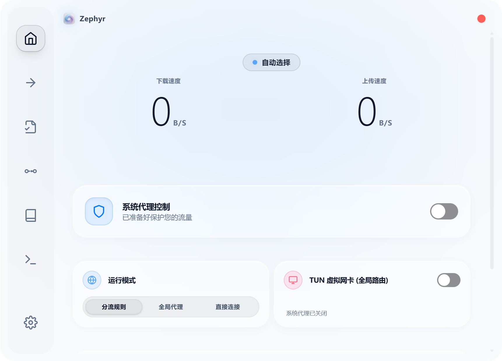
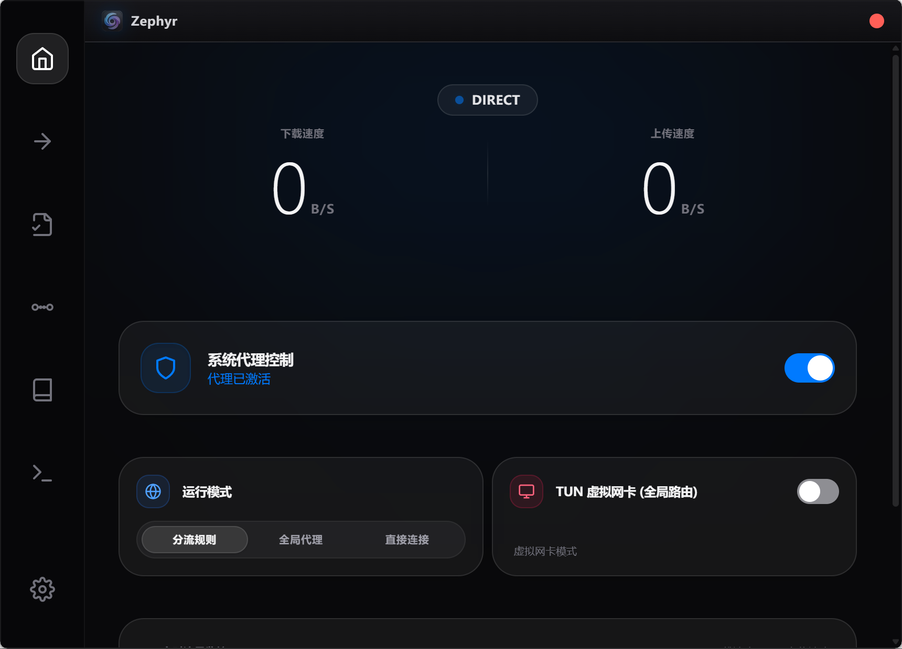
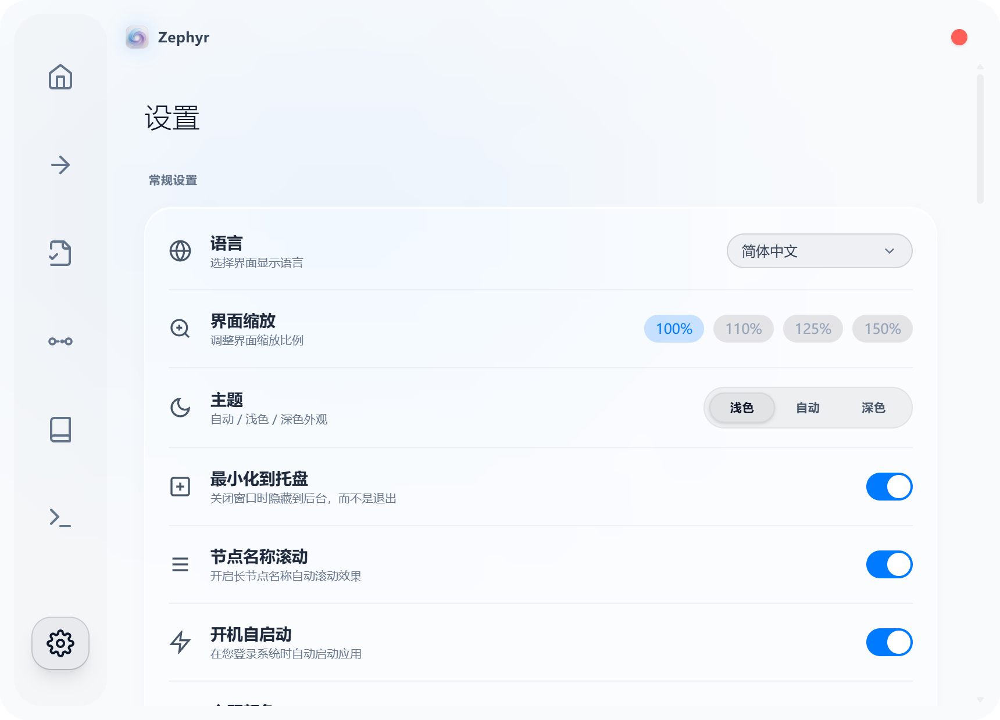

<div align="center">


# Zephyr

**安全至上 · 极简美学 · 轻量高效**

*一款 Mihomo GUI。*

[](...)
[](...)
[](LICENSE)
[](#安装)
[](...)
[](#安全设计)
[](https://github.com/Juwan-Hwang/Zephyr/actions)
[](https://github.com/Juwan-Hwang/Zephyr/actions)
[](https://tauri.app)
[](https://www.rust-lang.org/)


[简体中文](README.md) | [English](README_en.md)

</div>

---

## 快速上手

**五分钟，从零到通：**

1. **下载** — 前往 [GitHub Releases](https://github.com/Juwan-Hwang/Zephyr/releases) 获取最新版本
2. **安装** — 运行安装程序（便携版则解压即可）
3. **导入** — 通过 URL或文件添加订阅
4. **选节点** — 从列表中选定一个代理节点
5. **开代理** — 开启系统代理或 TUN 模式

至此，你的流量已通过所选节点转发。

> **透明声明**：本项目全部内容由 AI 生成（包括这段文字）。安全措施已部署——详见[安全设计](#安全设计)——但安全性、稳定性与性能均不应被视为已经充分验证。使用前请自行评估风险。如发现安全问题，欢迎提交 Issue。

---

## 截图



<details>
<summary>更多截图</summary>

| 深色模式 | 设置页面 |
|:---:|:---:|
|  |  |

</details>

---

## 何以 Zephyr？

Zephyr 起于一念之不忿。市面上的 Mihomo GUI，竟无符合我审美的。故动手“vibe coding”。

**视觉体验。** 毛玻璃卡片，渐变图标，深色模式，动画细节，疏密有致的排版。一个代理客户端，应当是设计出来的，而非拼凑出来的。

**安全边界。** 订阅、配置、脚本、文件、更新、深链——每一处入口都有明确的约束。纵深设防。

**规则能力。** Prism Engine 带来声明式规则补丁、智能节点选择与脚本沙箱。更强的能力，更少的复杂。

完整功能清单见 [FEATURES.md](FEATURES.md)。

---

## 社区成长

Zephyr 正受到开发者与用户的关注。

<a href="https://www.star-history.com/?repos=Juwan-Hwang%2FZephyr&type=timeline&legend=top-left">
  <picture>
    <source media="(prefers-color-scheme: dark)" srcset="https://api.star-history.com/chart?repos=Juwan-Hwang/Zephyr&type=timeline&theme=dark&legend=top-left" />
    <source media="(prefers-color-scheme: light)" srcset="https://api.star-history.com/chart?repos=Juwan-Hwang/Zephyr&type=timeline&legend=top-left" />
    
  </picture>
</a>

---

## 功能特性

### 核心能力

- **Mihomo 核心管理** — 启动、停止、重启代理核心
- **多配置管理** — 创建、编辑、切换 YAML 配置
- **订阅管理** — URL、文件、拖拽导入，Base64 自动解码
- **代理模式切换** — 规则、全局、直连三种模式
- **系统代理** — Windows / macOS / Linux 原生系统代理管理
- **TUN 模式** — 系统级代理
- **连接与流量** — 实时连接列表、连接关闭、上下行速度、历史趋势

### Prism Engine

Zephyr 内置基于 `clash-prism-*` crate 的规则引擎，用以增强 Mihomo 的配置能力：

| 特性 | 说明 |
|------|------|
| **声明式规则补丁** | `.prism.yaml` 支持 `$prepend`、`$append`、`$filter`、`$override` 及 `__when__` 条件 |
| **规则库管理** | 增删改查、分组、导入、自动应用、文件监听 |
| **智能节点选择** | 基于延迟、成功率、稳定性的 EMA 评分与自适应调度 |
| **Failover** | 节点故障时自动切换，支持阈值、冷却与回退策略 |
| **脚本沙箱** | QuickJS 执行环境，设有时间、内存、字符串长度、循环与递归等资源限制 |
| **插件系统** | 插件发现、加载、生命周期钩子及细粒度权限控制 |
| **KV 存储** | 持久化键值存储 |

### 安全设计

Zephyr 采用纵深防御策略：

| 层级 | 防护手段 | 实现方式 |
|------|----------|----------|
| **加密** | 机器绑定加密 | 以硬件指纹派生密钥加密订阅元数据；代理配置（YAML）明文存储 |
| **网络** | SSRF 防护 | 订阅与规则 URL 下载前进行 DNS 验证；重定向至内网地址将被拦截 |
| **网络** | DNS 防泄漏 | TUN 模式自动注入 `dns-hijack`，将全部 DNS 流量劫持至 Mihomo |
| **配置** | 配置清洗 | 递归移除危险 YAML 字段，限制 provider 路径遍历 |
| **脚本** | 权限控制 | 脚本执行受资源限制与权限限制双重约束 |
| **输入** | 输入验证 | IPC 命令入口进行长度、格式及 UTF-8 安全校验 |
| **限流** | 双重限流 | 常规命令固定冷却 + Prism 命令滑动窗口 |
| **文件** | 文件安全 | 安全权限、UUID 临时文件、压缩包路径遍历防护、符号链接拒绝、压缩炸弹检测 |
| **更新** | 更新完整性 | SHA256 校验、可信主机限制、原子更新与自动回滚 |
| **深链** | 深链安全 | 限制 `clash://` 协议入口与 URL scheme |
| **构建** | CSP 与加固 | 限制脚本与连接来源，release 启用 LTO、strip、`panic=abort` |

### 系统集成

- 系统托盘状态图标与快捷菜单
- 全局快捷键：窗口唤出、系统代理、TUN、代理模式切换
- `clash://` 深链订阅导入
- Windows UWP 环回免除
- Mihomo 核心、GeoIP / GeoSite 数据及 Zephyr 客户端更新
- 开机自启、系统通知、配置目录打开

### UI / UX

- 透明无边框窗口，自定义标题栏
- **UI 缩放**：1x - 1.5x 界面缩放，适配不同分辨率
- 虚拟滚动日志，分级过滤，正则搜索
- CodeMirror 6 编辑器，支持 Prism DSL 语法高亮与补全
- 代理节点卡片 3D 交互效果
- 主题系统：预设主题与自定义颜色
- i18n：英文基准，中文完整翻译，日文/韩文部分翻译（回退至英文）
- 前端事件总线、集中式状态与缓存层

---

## 技术栈

| 层级 | 技术 | 说明 |
|:---:|:---:|:---|
| 桌面框架 | Tauri v2 | 轻量桌面应用框架 |
| 后端 | Rust 1.92+ | IPC、系统集成、核心管理、安全边界 |
| 前端 | 原生 JavaScript | 无前端框架依赖 |
| 样式 | Tailwind CSS v4 | 现代原子化样式系统 |
| 编辑器 | CodeMirror 6 | Prism DSL 编辑体验 |
| 规则引擎 | clash-prism-* | 规则补丁、插件、脚本沙箱、智能选择 |
| 包管理 | pnpm workspace | `apps/*` + `packages/*` monorepo |
| 代理核心 | Mihomo | Clash Meta 内核 |

---

## 安装

### 系统要求

| 平台 | 最低版本 |
|:--------:|----------------|
| Windows | Windows 10 1809+ |
| macOS | macOS 10.15 (Catalina)+ |
| Linux | glibc 2.31+（Ubuntu 20.04+、Debian 11+、Fedora 34+） |

**硬件**：约 300MB 内存，约 50MB 磁盘空间（完整版）

### 下载

前往 [GitHub Releases](https://github.com/Juwan-Hwang/Zephyr/releases) 下载对应平台的安装包。

| 类型 | 说明 | 适用场景 |
|:---:|------|---------|
| **Full** | 含 Mihomo 核心及 GeoIP / GeoSite 数据 | 首次安装、离线使用 |
| **Lite** | 体积更小，不含核心资源 | 已有本地核心资源 |
| **Portable** | 解压即用，数据存储于程序目录 | U 盘携带、多设备使用 |

### 便携版使用

1. 下载 `Zephyr-windows-portable.zip` 或 `Zephyr-linux-portable.tar.gz`
2. 解压至任意目录
3. 在目录中创建名为 `.portable` 的空文件（首次运行时会自动创建）
4. 运行可执行文件

> **便携版限制**：不支持开机自启及客户端内更新。详见 [PORTABLE.md](PORTABLE.md)。

---

## 从源码构建

### 前置要求

- Rust 1.92 或更高版本
- Node.js 18 或更高版本
- pnpm 10 或更高版本
- 对应平台的 Tauri 系统依赖

### 开发模式

```bash
pnpm install
pnpm run dev
```

### 构建

```bash
pnpm run build
```

### 验证命令

```bash
pnpm run typecheck
pnpm run test
pnpm run lint
pnpm run check:i18n
```

桌面包亦可单独执行：

```bash
pnpm --filter @zephyr/desktop typecheck
pnpm --filter @zephyr/desktop test
pnpm --filter @zephyr/desktop lint
pnpm --filter @zephyr/desktop build:css
```

Rust 侧验证：

```bash
cd apps/desktop/src-tauri
cargo check
cargo test
cargo clippy --all-targets --all-features
```

---

## 项目结构

```text
.
├── apps/
│   └── desktop/                 # Tauri 桌面应用
│       ├── src/                 # 原生 JS 前端、样式、UI 模块
│       └── src-tauri/           # Rust 后端、IPC、系统集成、Prism 能力
├── packages/
│   ├── shared/                  # 前端共享代码
│   └── scripts/                 # 项目脚本，如 i18n 检查
├── FEATURES.md                  # 功能清单
├── package.json                 # workspace 根脚本
└── pnpm-workspace.yaml          # pnpm workspace 配置
```

---

## FAQ


<details>
<summary><strong>使用安全吗？</strong></summary>

Zephyr 采用了纵深防御策略：SSRF 防护、脚本沙箱、更新完整性校验等。代码库在 CI 中由 CodeQL 与 Semgrep 扫描。详见[安全设计](#安全设计)。

但请注意：本项目全部内容由 AI 生成，安全性、稳定性与性能均不应被视为已经充分验证。使用前请自行评估风险。如发现安全问题，请参照 [SECURITY.md](https://github.com/Juwan-Hwang/Zephyr/blob/main/SECURITY.md) 反馈。
</details>

<details>
<summary><strong>我的 PR 会被合并吗？</strong></summary>

本项目首先服务于个人使用场景，PR 不保证合并。如有不同需求，Fork 后直接改通常更快。
</details>

<details>
<summary><strong>Full 和 Lite 有什么区别？</strong></summary>

**Full** 含 Mihomo 核心及 GeoIP/GeoSite 数据，适合首次安装或离线使用。**Lite** 体积更小，但需已有本地核心资源。
</details>


---

## 社区

- [GitHub Issues](https://github.com/Juwan-Hwang/Zephyr/issues) — Bug 反馈与功能请求
- [GitHub Releases](https://github.com/Juwan-Hwang/Zephyr/releases) — 更新日志与下载

> **注意**：本项目首先服务于个人使用场景。PR 不保证合并。如有特定需求，Fork 通常更快。

---

## 贡献

欢迎提交：

- 可复现的 Bug 报告
- 安全问题反馈
- 边界清楚的小修复
- 不改变项目方向的质量改进

---

## License

本项目使用 [MIT License](LICENSE)。

---

## 致谢


- [Mihomo](https://github.com/MetaCubeX/mihomo) — 核心
- [Tauri](https://tauri.app) — 框架
- [Tailwind CSS](https://tailwindcss.com) — 样式
- [CodeMirror](https://codemirror.net) — 编辑器
- [clash-prism-*](https://github.com/Juwan-Hwang/Clash-Prism-Engine) — 规则

---


**Conjured by Juwan**

[返回顶部](#zephyr)
